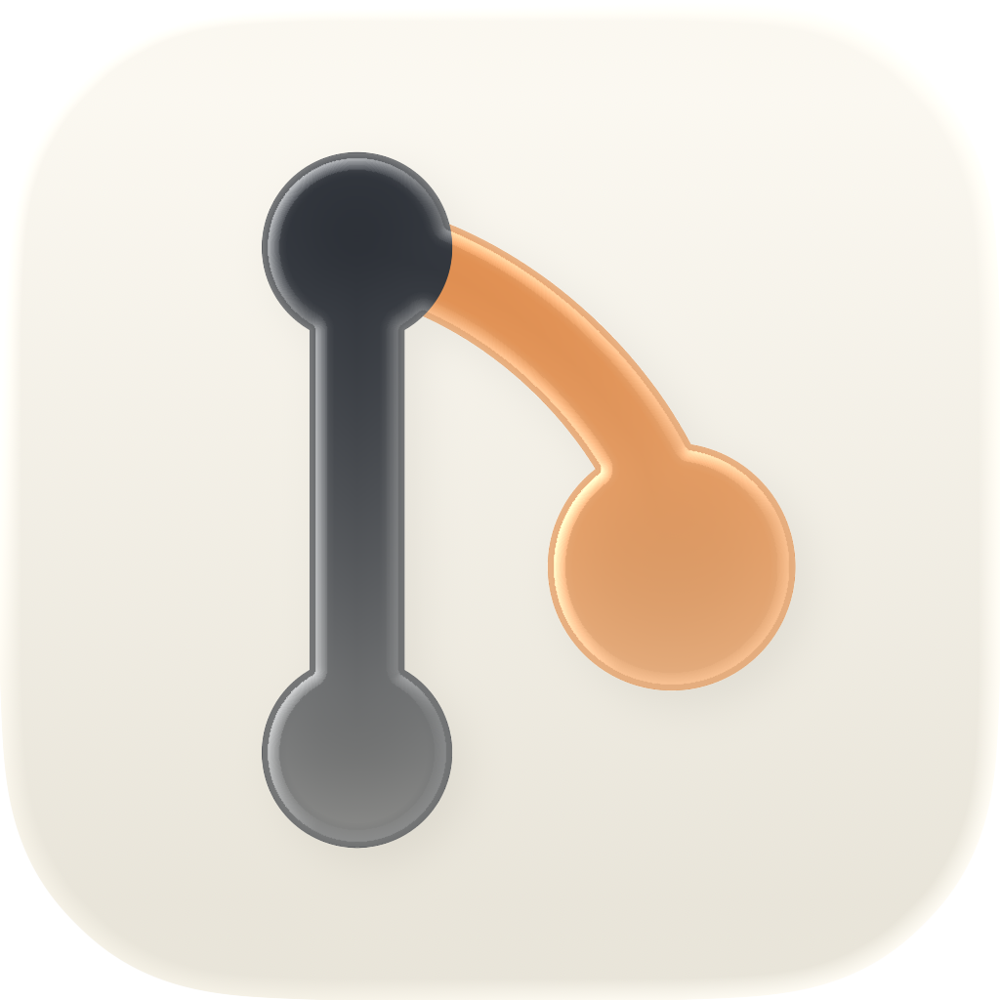

<p align="center">
  
</p>

<h1 align="center">gbar</h1>

<p align="center">
  <strong>Your whole GitHub life, one glance away in the macOS menu bar.</strong><br>
  Pull requests, issues, CI, notifications and quick actions — without opening a browser tab.
</p>

<p align="center">
  <em>Like <a href="https://github.com/menubar-apps/PullBar">PullBar</a>, but broader —
  and source-available.</em>
</p>

<p align="center">
  <a href="https://github.com/jaylann/gbar/actions/workflows/ci.yml"></a>
  <a href="https://github.com/jaylann/gbar/releases/latest"></a>
  <a href="LICENSE"></a>
  
  
  <a href="https://tuist.dev"></a>
</p>

<p align="center">
  <a href="#quickstart">Quickstart</a> ·
  <a href="#features">Features</a> ·
  <a href="#gbar-vs-pullbar">vs. PullBar</a> ·
  <a href="#install">Install</a> ·
  <a href="#build-from-source">Build</a> ·
  <a href="#authentication">Auth</a> ·
  <a href="#license">License</a>
</p>

---

**gbar** puts everything you track on GitHub — pull requests, issues, CI status,
notifications and quick actions — into your macOS menu bar, one glance away. It's like
[PullBar](https://github.com/menubar-apps/PullBar), but broader: a *general* GitHub bar,
not a PR-only viewer. Free to run, self-host and modify; source-available under PolyForm
Shield.

## Why gbar

- **Glanceable.** What needs you — PRs awaiting your review, failing CI, new review
  requests — reads straight from the menu bar, no window required.
- **Broader than PRs.** Issues, checks, notifications, starred repos, a per-repo
  watchlist and arbitrary saved searches — not just an assigned-PR list.
- **Yours to run.** OAuth device flow or a PAT, tokens in the Keychain, no backend.
  Self-host free, or pay for a pre-configured build. Source-available, no lock-in.

## Quickstart

```bash
brew install --cask jaylann/tap/gbar
```

Launch **gbar**, click *Sign in with GitHub* (or paste a token), and it lands in your
menu bar. See [Install](#install) for the DMG and [Authentication](#authentication) for
the self-host setup.

## Features

<table>
<tr>
<td width="50%" valign="top">

**🔀 Pull requests**<br>
Created / assigned / review-requested / mentioned, with author, approvals, +/− line
counts and age.

</td>
<td width="50%" valign="top">

**🐛 Issues**<br>
Created / assigned / mentioned, alongside your PRs in one place.

</td>
</tr>
<tr>
<td width="50%" valign="top">

**✅ Rich CI / checks**<br>
Per-check pass / fail / pending status surfaced on each PR.

</td>
<td width="50%" valign="top">

**⚡ Quick actions**<br>
Open in browser, approve, merge, mark notifications read — from the menu.

</td>
</tr>
<tr>
<td width="50%" valign="top">

**🔔 Desktop notifications**<br>
New PRs, review requests assigned to you, and status changes.

</td>
<td width="50%" valign="top">

**⭐ Starred signal**<br>
A star marker on any row whose repo you've starred, plus a cross-tab "Starred" filter.

</td>
</tr>
<tr>
<td width="50%" valign="top">

**👁 Watchlist → Actions & Releases**<br>
Curated `owner/name` repos feed a workflow-runs tab and a "what shipped" releases digest.

</td>
<td width="50%" valign="top">

**🔎 Custom saved queries**<br>
Any GitHub search string becomes its own menu section.

</td>
</tr>
<tr>
<td width="50%" valign="top">

**🏢 Multiple accounts, orgs & Enterprise**<br>
Point it at any API base URL, including GitHub Enterprise.

</td>
<td width="50%" valign="top">

**🎛 Configurable**<br>
Poll interval and a menu-bar badge with live counts.

</td>
</tr>
</table>

See [`docs/PRODUCT.md`](docs/PRODUCT.md) for the full scope and roadmap.

## gbar vs. PullBar

gbar is inspired by [PullBar](https://github.com/menubar-apps/PullBar) but aims to be a
*general* GitHub bar rather than a PR viewer.

| | gbar | PullBar |
|---|:---:|:---:|
| Pull requests (created / assigned / review-requested) | ✅ | ✅ |
| Mentioned pull requests | ✅ | — |
| Issues | ✅ | — |
| CI / checks | ✅ per-check | ✅ check suites |
| Quick actions (approve / merge / mark read) | ✅ | — |
| Desktop notifications | ✅ | — |
| Starred signal & filter | ✅ | — |
| Watchlist → Actions & Releases | ✅ | — |
| Custom saved queries | ✅ | — |
| Multiple accounts, orgs & GitHub Enterprise | ✅ | — |
| Auth | OAuth device flow **or** PAT | PAT |
| Source-available | ✅ | — |

<sub>Compared against the free PullBar; PullBar Pro adds features not listed here.</sub>

## Install

The signed, notarized build (opens with no Gatekeeper prompt) is on the
[Homebrew tap](https://github.com/jaylann/homebrew-tap):

```bash
brew install --cask jaylann/tap/gbar
```

Or grab the `.dmg` from the [latest release](https://github.com/jaylann/gbar/releases/latest).

## Build from source

```bash
just bootstrap   # wire git hooks + materialize local xcconfigs
just gen         # tuist install + generate the Xcode project
just build       # build the macOS app
just run         # build and launch
```

## Authentication

gbar is **free to run, self-host and modify**. Authentication uses GitHub's OAuth
**device flow**, which needs only a public client ID — no server, no secret. Your tokens
live in the **macOS Keychain**, never on disk in plaintext.

- **Self-host (free):** register your own GitHub OAuth App in ~2 minutes, paste its
  client ID into Settings once (or use a personal access token). Guide:
  [`docs/SELF-HOST.md`](docs/SELF-HOST.md).
- **Paid ("I'll configure it for you"):** get a build pre-configured with a ready-to-go
  client ID (and, later, a hosted convenience backend) so you just click
  *Sign in with GitHub*. This funds maintenance. Contact
  [lanfermann.dev](https://lanfermann.dev).

## Stack

SwiftUI (`MenuBarExtra`, `LSUIElement` agent) · macOS 14+ · Swift 6 (strict
concurrency) · [Tuist](https://tuist.dev) · SwiftFormat + SwiftLint · `just`.

## Conventions

- **Branches:** `stage` is the working branch; `main` is release/tag-only.
- **Commits:** [Conventional Commits](https://www.conventionalcommits.org/) — enforced
  by a local `commit-msg` hook and the `pr-title` CI check.
- **Lint/format:** `just check` (SwiftFormat + SwiftLint). Run before pushing.

## License

**Source-available under the [PolyForm Shield License 1.0.0](LICENSE).** You may use,
self-host, modify and redistribute gbar freely — but **not** to build a product or
service that competes with gbar or with the paid/hosted gbar offering. This is *not*
an OSI-approved license; that's deliberate, so the paid tier that funds the project
can't simply be resold out from under it.
